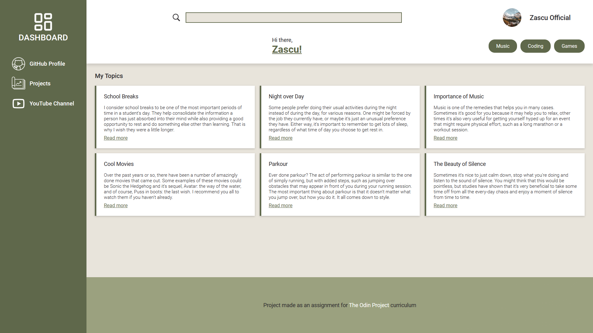

# The Odin Project - Admin Dashboard

## 📖 About

A dashboard page built after the design given in an assignment for the `Odin Project` curriculum.

In this project I did my best to implement:
1. CSS Grid
2. CSS Flex-box
3. Responsiveness using media queries

## 🖼️ [Live Preview Link](https://zascuofficial-admin-dashboard.netlify.app/ "The live preview of the page")

## 💻 Technologies Used

